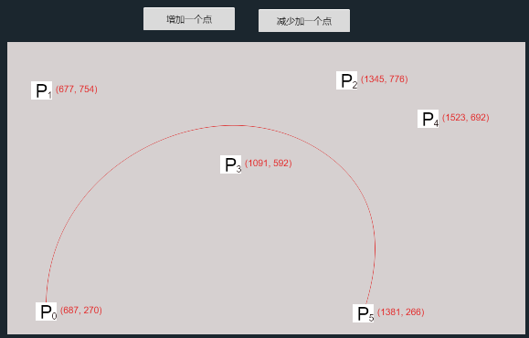
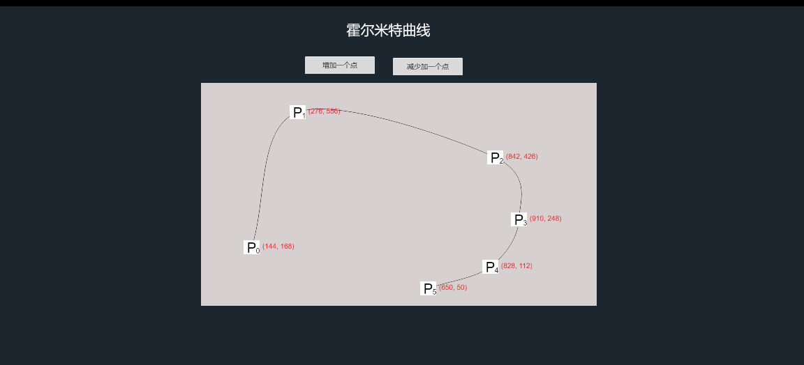

# 这是个 曲线的故事
### 一个是N 个控制点的(Bezier)贝塞尔   

### 一个是N个点的(Hermite)埃尔米特曲线

### cocoscreate 版本2.4.2
每一个scene 就是一个 曲线的编辑查看界面
参考资料
#### [贝塞尔 (Bezier) 曲线](https://zh.wikipedia.org/wiki/%E8%B2%9D%E8%8C%B2%E6%9B%B2%E7%B7%9A) 

#### [埃尔米特（Hermite)](http://www.tangrui.net/2006/algorithm-and-implementation-of-hermite-curve.html)

